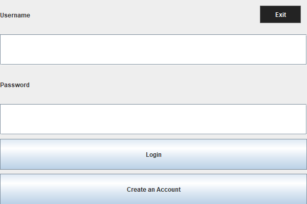
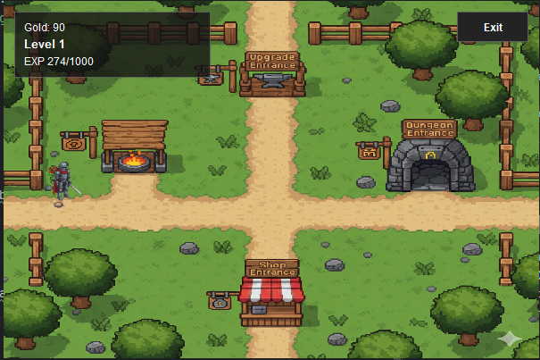
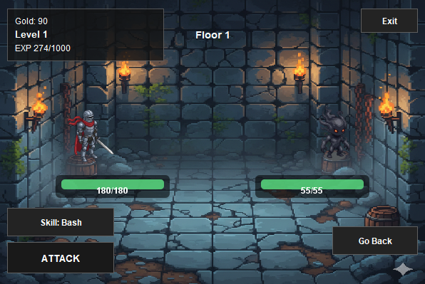

# BloodyRPG (MiniRPG) — Java OOP + Swing

Mini RPG berbasis Java Swing (CardLayout) dengan sistem **login/register**, **map movement**, **shop/upgrade screen**, dan **dungeon battle** dengan **coin + EXP + level**. Data user disimpan ke **CSV**.

---

## Cara Menjalankan
1. Buka project di **IntelliJ**.
2. Pastikan folder `resources/` sudah menjadi **Resources Root** (classpath).
3. Jalankan:
   - `src/miniRPG/util/Main.java`
4. Register → Login → pilih role → masuk Map → masuk Dungeon/Shop/Upgrade.

---

## Kontrol
- Move: `W A S D` atau Arrow Keys
- Navigasi:
  - Masuk screen lain dengan menyentuh area entrance di Map
  - `Go Back` untuk kembali ke Map
  - `Exit` untuk keluar (coin + exp disimpan)

---

## Fitur Utama (Minimal 4)
- **Auth**: Register & Login (CSV persistence)
- **Map**: Karakter bergerak dan bisa masuk ke **Shop / Upgrade / Dungeon**
- **Dungeon Battle**: Turn-based fight (Attack + Skill) dengan monster berbeda
- **Progression**: **Coin + EXP + Level** ditampilkan di HUD
- **UI polish**: overlay HUD + tombol konsisten + fade transition antar screen

---

## Aturan EXP, Level, dan Skill
- **EXP → Level**: level diturunkan dari total EXP (ditampilkan di HUD)
- **Skill**:
  - Setiap role punya 1 skill spesifik:
    - Warrior: **Bash**
    - Mage: **Conceal**
    - Archer: **SpiritArrow**
  - Skill **tidak menghabiskan turn** (dalam 1 turn player bisa skill + attack)
  - Skill **hanya bisa dipakai 1x setiap floor/run**
  - Setelah dipakai, teks tombol berubah menjadi **“{SkillName} Skill Has Been Used”**

---

## Struktur Folder & Package
- `miniRPG.auth`
  - `AuthService`, `UserRepositoryCsv` (login/register + load/save CSV)
- `miniRPG.session`
  - `GameSession`, `SessionService`, `SessionBootstrap` (state username/coin/exp)
- `miniRPG.character`
  - `Character`, `Player`, `Warrior`, `Mage`, `Archer`
- `miniRPG.skill`
  - `Skill`, `Bash`, `Conceal`, `SpiritArrow`
- `miniRPG.monster`
  - `Monster`, `MonsterFactory`
  - `normalMonster/*`, `bosses/*`
- `miniRPG.dungeon`
  - `BattleContext`, `DungeonController` (battle flow)
- `miniRPG.map`
  - `MapController`, `MapLayout` (movement + entrance detection)
- `miniRPG.ui`
  - `ui.asset/AssetLoader` (load image dari resources)
  - `ui.screen/*` (AppFrame + Panel Swing)
  - `component/FadeOverlay` (fade transition)
- `resources/images/*`
  - Asset PNG (map, dungeon, shop, upgrade, sprites, icons)

---

## Penerapan OOP (Rubrik 35%)
**Encapsulation**
- State karakter (HP/ATK/DEF/EXP/coin) disimpan di class domain (`Character/Player/Monster`).
- UI memanggil method public (mis. serang/skill/restore), bukan mengubah state internal secara langsung.

**Inheritance**
- `Warrior/Mage/Archer` mewarisi `Player`.
- `Monster` mewarisi `Character`.

**Polymorphism**
- Skill: `Skill` base class dengan implementasi berbeda (`Bash/Conceal/SpiritArrow`).
- Monster dibuat lewat `MonsterFactory` dan diperlakukan sebagai `Monster` di battle.

**Abstraction**
- Battle menggunakan `BattleContext` + controller (`DungeonController`) sehingga UI panel tidak menampung seluruh logic.

---

## File Handling / Database & Exception (Rubrik 10%)
- Data user disimpan di `users.csv` melalui `UserRepositoryCsv`.
- Coin dan EXP **disimpan saat Exit** (session dipersist saat keluar).
- Loading file (CSV & asset) memakai try/catch agar aplikasi tidak crash saat resource hilang.

---

## Asset
- File image berada di: `resources/images/*.png`
- Di runtime, akses dengan path:
  - `"/images/map.png"`, `"/images/shop.png"`, dll

---

## Screenshots
1. Login

2. Map screen (HUD + karakter)

4. Dungeon battle

---

## Author
- 2802438224 - Saladin Zhalifunans Ahfar
- 2802438060 - Jecsen
- 2802439643 - Jason Clein
